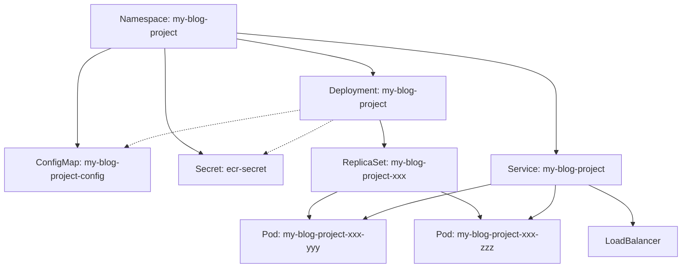

# 📁 專案架構總覽

## 🏗️ Kubernetes 資源架構

### 模組化設計
每個 Kubernetes 資源都有獨立的 YAML 文件，方便管理和理解：

```
k8s/
├── 🏷️  namespace.yaml      → 創建專屬命名空間
├── ⚙️  configmap.yaml      → 應用程式配置
├── 🔐 secret.yaml          → ECR 認證密鑰
├── 🚀 deployment.yaml      → Pod 部署定義
├── 🌐 service.yaml         → 負載均衡服務
├── 📦 kustomization.yaml   → 部署管理
└── 📖 README.md           → 配置說明
```

### 資源對應關係



## 🔄 部署流程

### GitHub Actions CD 流程
1. **📦 Checkout** → 獲取代碼
2. **🔑 AWS Auth** → 配置 AWS 認證
3. **🐳 ECR Login** → 登入 Docker Registry
4. **🏗️ Build & Push** → 建置並推送映像
5. **⚙️ Verify kubectl** → 檢查集群連接
6. **🧹 Cleanup** → 清理已存在資源
7. **🔐 Create Secret** → 創建 ECR 認證
8. **🎯 Update Image** → 更新映像標籤
9. **📋 Deploy** → 部署所有資源
10. **⏳ Wait** → 等待部署完成
11. **📊 Verify** → 驗證部署狀態

### 手動部署流程
```bash
# 清理
./scripts/cleanup.sh

# 部署
./scripts/deploy.sh [image-tag]
```

## 🎯 優勢

✅ **模組化**: 每個資源獨立管理  
✅ **易讀性**: 清晰的文件結構和命名  
✅ **可維護**: 單一職責原則  
✅ **版本控制**: 每個配置都有版本追蹤  
✅ **重用性**: 配置可以在不同環境重用  
✅ **故障排除**: 容易定位問題所在的資源  

## 🔧 管理命令

```bash
# 查看所有資源
kubectl get all -n my-blog-project

# 查看特定資源
kubectl get pods -n my-blog-project
kubectl get services -n my-blog-project
kubectl get deployments -n my-blog-project

# 查看日誌
kubectl logs -n my-blog-project -l app=my-blog-project

# 描述資源詳情
kubectl describe deployment my-blog-project -n my-blog-project
kubectl describe service my-blog-project -n my-blog-project
```
